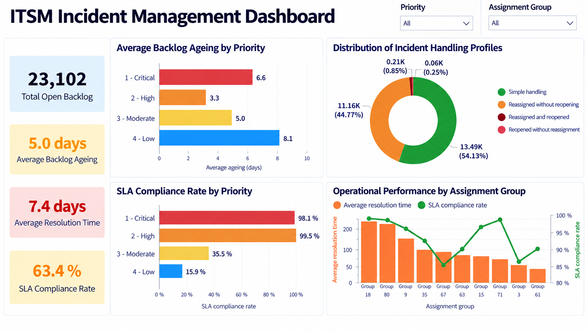
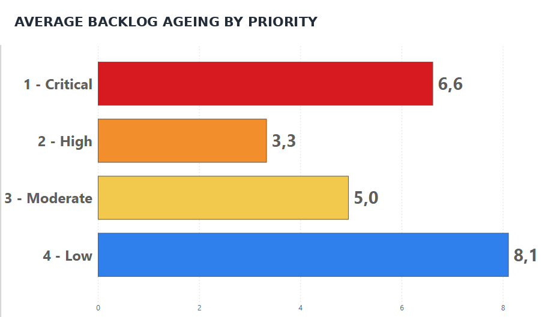
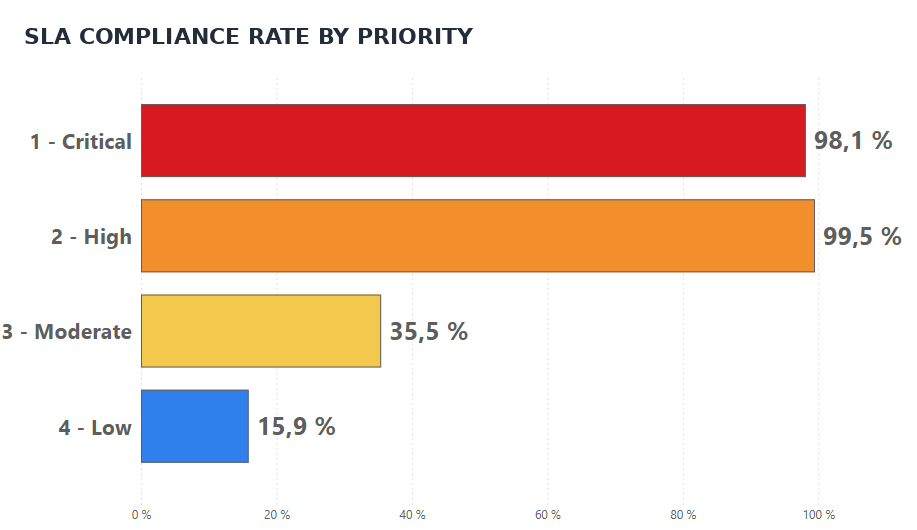
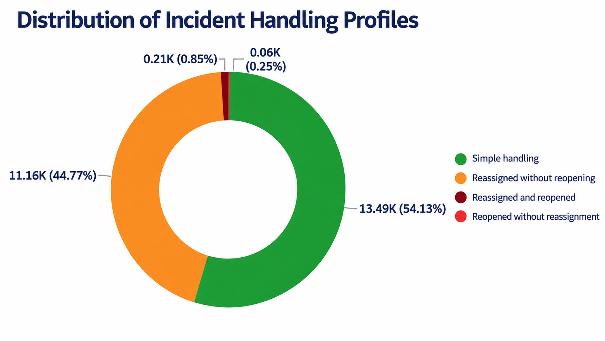
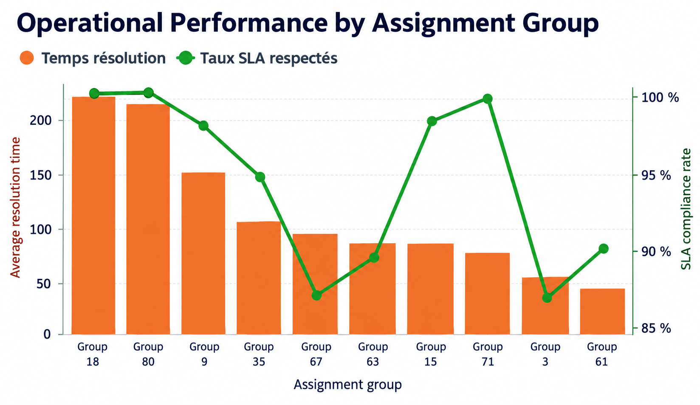

# ITSM Incident Management Analytics

## Critical Incident Management & Operational Continuity

### Project Overview

In digital service operations, critical incidents are more than technical tickets. They can rapidly affect service quality, SLA commitments, operational continuity, and user experience.

This project presents a decision-support dashboard developed in Power BI to identify operational pressure points, monitor the performance of the incident management process, and support operational decision-making.

The analysis is based on an ITSM dataset containing **141,712 records**, with particular attention to data quality, business consistency of the indicators, and the transformation of operational data into decision-relevant information.

### Project at a Glance

| Indicator | Value |
|---|---:|
| Records analysed | **141,712** |
| Business insights | **4** |
| Key monitoring indicators | **5** |

### Skills Demonstrated

**Power BI · Excel · Data Quality · DAX · KPI Monitoring · SLA Analysis · Incident Management · Operational Performance · PMO ITSM**

---

## Analytical Objective

> **Identify operational pressure points that may affect SLAs, service quality, and operational continuity in order to support better-informed decision-making.**

The objective was not simply to measure activity, but to identify operational areas requiring attention and translate incident data into actionable information for performance management.

---

## Analytical Approach

### 1. Data Quality & Validation

Before building the Power BI dashboard, a data validation phase was carried out in Excel to secure the consistency and reliability of the indicators.

The main controls included:

- validation of data types;
- identification of missing values;
- consistency checks across opening, update, resolution, and closure dates;
- validation of SLA logic against the dataset documentation;
- analysis of incident statuses;
- validation of reassignment and reopening variables;
- consistency checks between open incidents and resolved/closed incidents.

Particular attention was given to the `made_sla` variable. According to the dataset documentation, this variable indicates whether an incident exceeded its SLA target. Clarifying this definition was essential to avoid reversing the interpretation between incidents that met the SLA and those that exceeded it.

This validation phase ensured that the KPIs developed in Power BI reflected a reliable business interpretation rather than a purely automated use of the available fields.

### 2. Power BI Modelling

Two tables were used:

- `Incident_Open_Backlog` for the analysis of open incidents;
- `Incident_Resolved_Closed` for the analysis of resolved and closed incidents.

DAX measures were developed to monitor the main performance indicators:

- Total Open Backlog;
- Average Backlog Ageing;
- Average Resolution Time;
- SLA Compliance Rate;
- Operational Treatment Complexity.

Performance was then compared across:

- priority levels;
- assignment groups;
- incident handling profiles.

### 3. Dashboard Objective

The dashboard was designed as an operational performance management tool for monitoring the incident management process.

It addresses five key business questions:

1. Are critical incidents meeting their SLA commitments?
2. Which priority levels accumulate the most operational debt?
3. Which assignment groups have the highest resolution times?
4. Where are the main sources of friction in incident handling?
5. Which signals require priority management action?

The dashboard therefore supports:

- monitoring service quality;
- tracking SLA commitments;
- identifying operational pressure points;
- detecting risks to service continuity;
- supporting data-driven decisions.

---

## Final Dashboard

### Dashboard KPIs

| KPI | Value |
|---|---:|
| Total Open Backlog | **23,102** |
| Average Backlog Ageing | **5.0 days** |
| Average Resolution Time | **7.4 days** |
| SLA Compliance Rate | **63.4%** |

The dashboard brings together backlog exposure, ticket ageing, SLA performance, resolution time, and incident handling profiles to provide an operational view of the incident management process.

---

# Business Insights & Decision Support

## 1. Operational Debt Is Concentrated in Low-Priority Tickets

| Priority | Average Backlog Ageing |
|---|---:|
| Critical | **6.6 days** |
| High | **3.3 days** |
| Moderate | **5.0 days** |
| Low | **8.1 days** |

**Observed Signal**

Low-priority incidents have the highest average backlog ageing, at **8.1 days**.

**Business Risk**

Their accumulation may create operational debt and progressively reduce the organisation's incident-handling capacity.

**Potential Decision**

Introduce dedicated windows for processing ageing backlog and monitor low-priority tickets that exceed a defined ageing threshold.

---

## 2. Critical SLAs Are Strongly Preserved

| Priority | SLA Compliance Rate |
|---|---:|
| Critical | **98.1%** |
| High | **99.5%** |
| Moderate | **35.5%** |
| Low | **15.9%** |

**Observed Signal**

Critical- and high-priority incidents have the highest SLA compliance rates.

**Business Risk**

Strong prioritisation of critical incidents may shift operational pressure towards moderate- and low-priority tickets.

**Potential Decision**

Maintain the current critical-incident prioritisation mechanisms while monitoring the evolution of the non-critical backlog.

---

## 3. Significant Operational Routing Friction

The incident handling profile shows:

- **Simple handling:** 13.49K incidents (**54.13%**)
- **Reassigned without reopening:** 11.16K incidents (**44.77%**)

The remaining handling profiles represent only a small proportion of incidents.

**Observed Signal**

A substantial proportion of incidents are reassigned without being reopened.

**Business Risk**

Successive reassignments may increase handling times and add workload to support teams.

**Potential Decision**

Review dispatch rules, incident categorisation, and ownership responsibilities across support levels.

---

## 4. Some Assignment Groups Concentrate Operational Pressure

**Observed Signal**

Some assignment groups have higher average resolution times than others.

**Business Risk**

These groups may become operational bottlenecks and progressively affect service quality.

**Potential Decision**

Assess the capacity of the affected groups, the types of incidents they handle, and potential operational bottlenecks.

---

# Operational Recommendations

## Strengthen Dispatch Mechanisms

Reduce successive reassignments through more precise routing rules and clearer ownership responsibilities across support groups.

## Monitor Ageing Backlogs

Implement dedicated monitoring for ageing tickets to prevent the progressive accumulation of operational debt.

## Assess the Capacity of High-Pressure Groups

Identify assignment groups with elevated resolution times and assess potential needs in terms of resources, skills, or organisation.

## Preserve Critical SLA Performance

Maintain the current mechanisms used to prioritise critical incidents while monitoring the overall balance of operational workload.

## Improve Incident Categorisation

Strengthen ticket classification quality to facilitate appropriate routing and improve handling from the first point of contact.

---

# Competencies Demonstrated

### Operational Analysis & Performance Management

- Definition and monitoring of performance indicators
- Backlog and incident-ageing analysis
- SLA monitoring
- Diagnosis of operational pressure points
- Development of decision-oriented insights

### Data & Business Intelligence

- Power BI
- DAX
- Excel
- Data quality control
- Data preparation and structuring

### Decision Support & Governance

- Operational performance management
- PMO and service governance
- Incident management
- Operational prioritisation
- Operational continuity

---

# Conclusion

This project demonstrates a performance- and decision-oriented analytical approach in which data is used not only to visualise activity, but also to identify operational pressure points, clarify management priorities, and support concrete continuous-improvement actions.

The analysis highlights a decision-support chain across:

**backlog ageing → SLA performance → routing friction → assignment-group pressure**

In a digital transformation context, this type of analysis can help strengthen digital service quality, improve control over service commitments, and support greater operational efficiency.

---

## Repository

**Repository:** `itsm-incident-management-analytics`

### Tools

`Power BI` · `DAX` · `Excel`

### Focus

`ITSM` · `Incident Management` · `SLA Performance` · `Backlog Management` · `Operational Performance` · `Decision Support`

---

**Nancy Lee YIMBERE ALAPINI**  
*Performance & Decision Intelligence Analyst*
